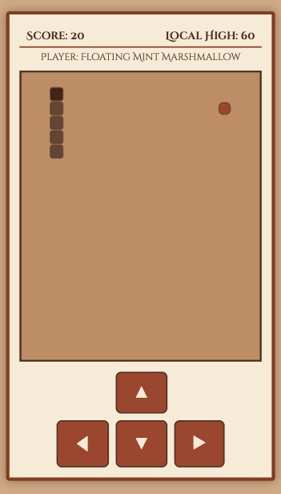

# Vibe AI Ancient Snake Game #

[

An "ancient"-themed, mobile-friendly implementation of the classic Snake game featuring a parchment aesthetic, automatic nickname generation, and an online leaderboard system.

**This project, including game logic, server code, and this README.md file, was primarily generated with assistance from Google Gemini.**

## ✨ Features

  * **Classic Snake Gameplay:** Control the serpent, eat food to grow longer, and avoid collisions\!
  * **Ancient Visual Style:** Features a user-friendly UI with parchment/sepia tones and thematic fonts.
  * **Mobile Optimized:** Designed primarily for mobile browsers in portrait mode, with large touch-button controls. Keyboard controls (arrow keys/WASD) are also supported.
  * **Random Nickname Generation:** Generates fun, random nicknames (e.g., "Sleeping Pink Bunny") for the leaderboard using combinations of `<Action><Color><CuteThing>`. Allows regeneration before submitting a score.
  * **Server-Side Leaderboard:** A Node.js backend using Express and SQLite stores the top 10 scores globally, including nickname, score, and timestamp.
  * **Local High Score:** Tracks the player's personal best score locally using browser Local Storage.

## 🛠️ Tech Stack

  * **Frontend (Client):**
      * HTML5
      * CSS3 (Flexbox, Grid)
      * Vanilla JavaScript (DOM Manipulation, Canvas API, Game Logic, Fetch API, Local Storage)
  * **Backend (Server):**
      * Node.js
      * Express.js (Web Framework)
      * `sqlite3` (SQLite Database Driver)
      * `cors` (Cross-Origin Resource Sharing)
      * `dotenv` (Environment Variable Management)
  * **Database:**
      * SQLite

## Demo & Screenshots

Play Demo: [Vibe AI Ancient Snake Game](https://ai-ancient-snake.talkingsource.com/)



## 📂 File Structure

The project is organized into two main directories:

```
ancient-snake/
├── client/             # Frontend files (HTML, CSS, JS)
│   ├── index.html
│   ├── script.js
│   └── style.css
├── server/             # Backend files (Node.js server)
│   ├── .env            # Environment variables (Gitignored)
│   ├── .env.sample     # Example environment file (Optional)
│   ├── leaderboard.db  # SQLite database file (Gitignored)
│   ├── package-lock.json
│   ├── package.json
│   └── server.js
├── doc/                # Optional: Screenshots or documentation
├── .gitignore          # Specifies intentionally untracked files
├── LICENSE             # ISC License
└── README.md           # This file
```

## 🚀 Server Installation(Optional)

### Prerequisites

  * [Node.js](https://nodejs.org/) (which includes npm) installed on your system.

### Steps

1.  **Clone the repository (or download the files):**
    *(Adjust command if using Git)*

    ```bash
    git clone https://github.com/whodidthese/vibe-ai-ancient-snake-game.git
    cd vibe-ai-ancient-snake-game
    ```

    *(Otherwise, navigate to the project's root directory)*

2.  **Install server dependencies:**

    ```bash
    cd server
    npm install
    ```

3.  **Set up environment variables:**

      * Copy `.env.sample` as `.env`: `cp .env.sample .env` in the `server/` directory.
      * Set the desired `PORT` for the server (defaults to 3330 if not set, based on `server.js`):
        ```
        PORT=3330
        ```

4.  **Run the backend server:**

      * While still in the `server` directory, run:
        ```bash
        npm start
        ```
        *Or, if you don't have a start script:*
        ```bash
        node server.js
        ```
      * The server should start, typically on `http://localhost:3330` (or the port you specified). You'll see log messages confirming the database connection and server start.

## 🎮 How to Play

  * **Controls:**
      * **Keyboard:** Use **arrow keys** (Up, Down, Left, Right) or **WASD** keys.
      * **Touchscreen:** Use the **on-screen buttons** (▲, ▼, ◀, ▶).
  * **Objective:** Guide the serpent to eat the food ( Sienna-colored squares) to grow longer and increase your score.
  * **Avoid:** Colliding with the walls or the serpent's own body.
  * **Game Over:**
      * When a collision occurs, the game ends.
      * Your final score and current nickname are displayed.
      * You can click the refresh icon (🔄) next to the nickname to generate a new one.
      * Click **"Submit Score"** to save your score and current nickname to the global leaderboard. The nickname used during submission will be saved locally for future games.
      * The Top 10 leaderboard is displayed.
      * Click **"Restart"** (enabled after submitting) to play again.

## 👤 Author

* **Who Did These** - [GitHub Profile](https://github.com/whodidthese/)